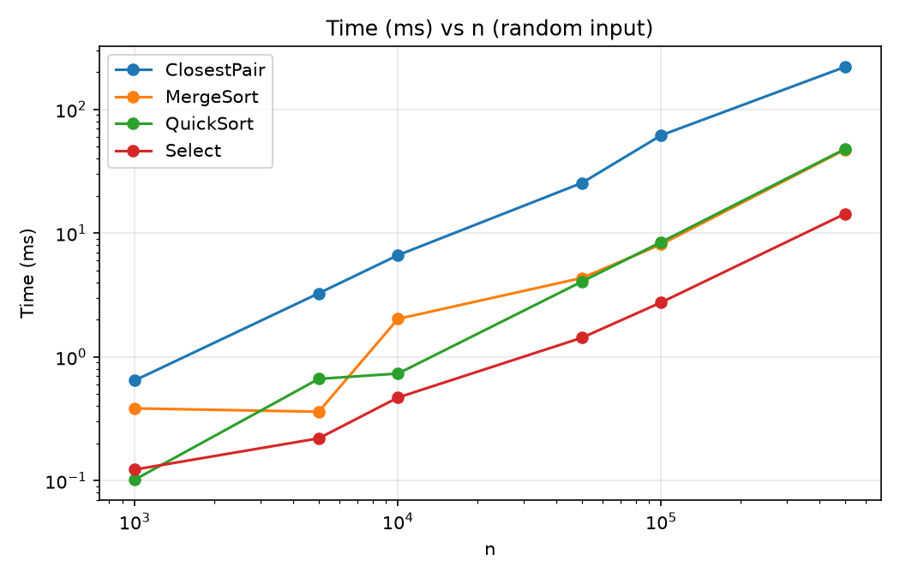
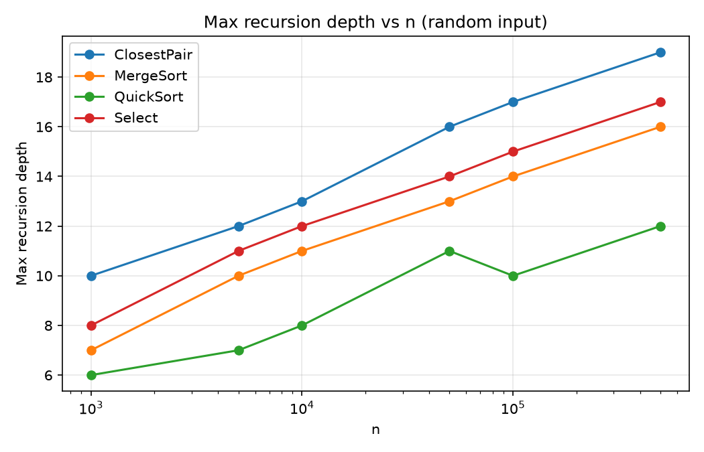
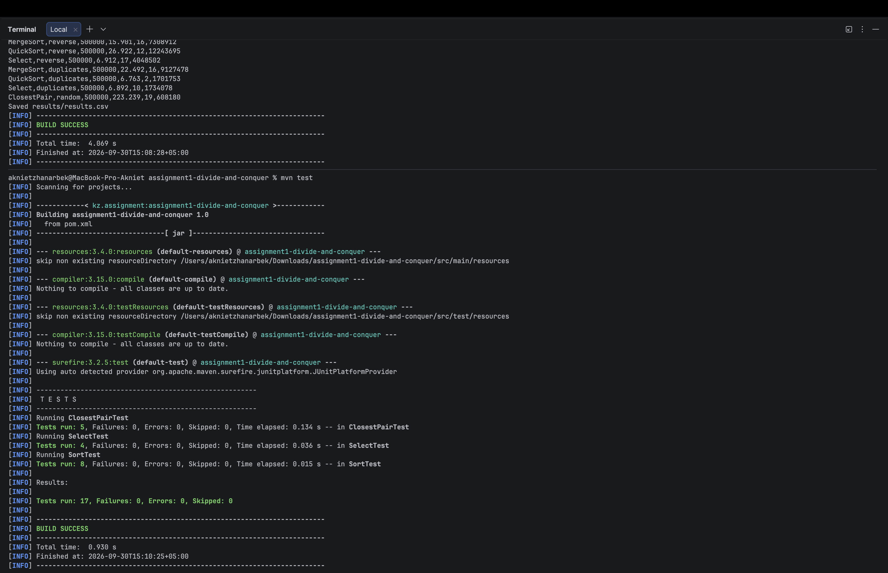
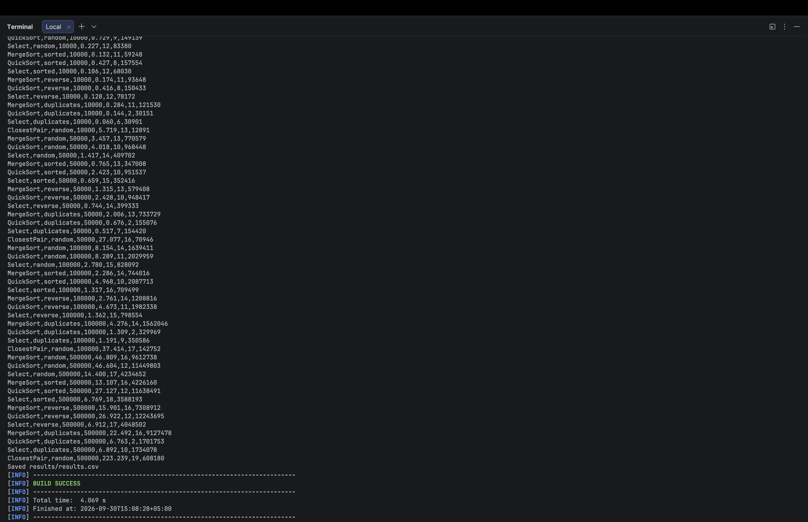
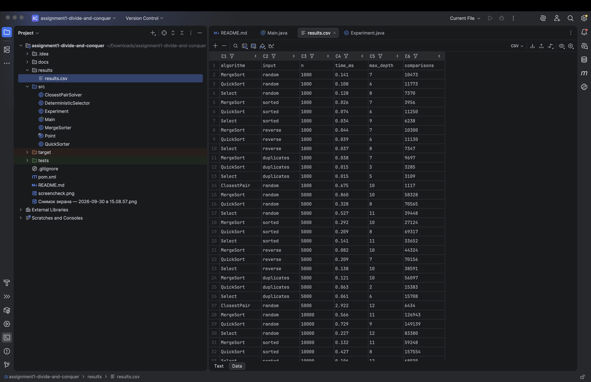
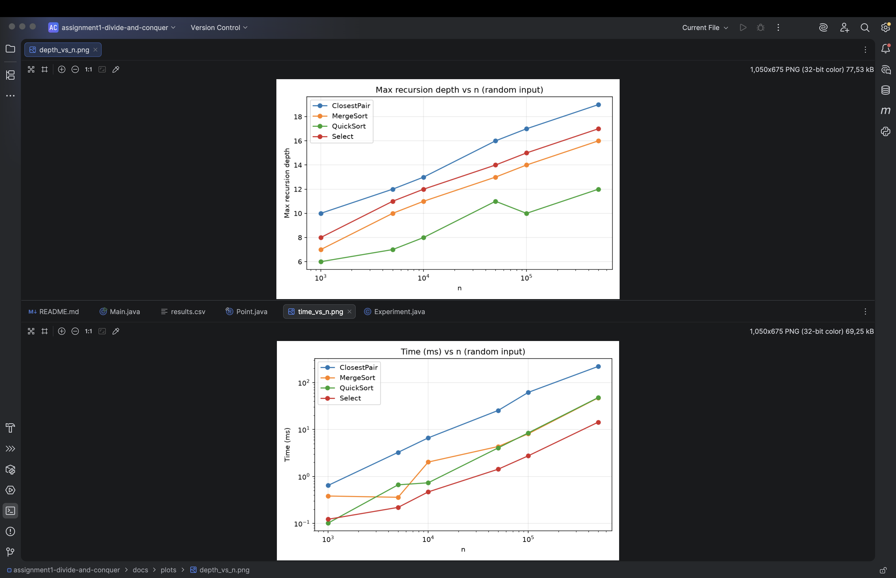

# Assignment 1: Divide-and-Conquer Algorithm Analysis

## A. Project Overview

The goal is to implement four classic divide-and-conquer algorithms in Java, measure them, and compare the measurements with the theory.

| Algorithm | Class | Idea |
|---|---|---|
| MergeSort | `MergeSorter` | Linear merge, one reusable buffer, insertion sort for n <= 16 |
| QuickSort | `QuickSorter` | Random pivot, in-place 3-way partition, recurse on the smaller side and loop on the larger |
| Deterministic Select | `DeterministicSelector` | Groups of 5, median of medians pivot, in-place partition, recurse into one side only |
| Closest Pair | `ClosestPairSolver` | Sort by x, split in half, merge by y, check the strip around the midline |

`Experiment` runs all algorithms and writes `results/results.csv`. `Main` starts it.

### How to run

```
mvn test                      # correctness tests
mvn compile exec:java         # run experiments, writes results/results.csv
python3 docs/plot.py          # creates docs/plots/*.png (needs pandas, matplotlib)
```

## B. Algorithm Analysis

**MergeSort.** Split in half, sort both halves, merge them in linear time using a single buffer allocated once.
T(n) = 2T(n/2) + Θ(n). Here a = 2, b = 2, f(n) = n = n^(log_b a), so Master Theorem case 2 gives **Θ(n log n)** in all cases. Space Θ(n) for the buffer, recursion depth about log2(n / 16).

**QuickSort.** A random element is the pivot; a 3-way partition puts smaller, equal and larger elements in place. The smaller side is handled by recursion and the larger by the loop.
Expected recurrence: T(n) = T(k) + T(n - k - 1) + Θ(n) with k close to uniform. Any split with constant proportions gives depth Θ(log n), so the expected time is **Θ(n log n)** (Akra–Bazzi intuition: the split fractions only change constants). Worst case is Θ(n²) when every split is 0 / n-1, which has probability that is tiny with a random pivot. Extra space is O(log n) because the recursive call always gets at most half of the range.

**Deterministic Select (median of medians).** Split into groups of 5, take each group's median, recursively find the median of those medians, use it as pivot, partition, and recurse into the side that contains k.
T(n) = T(n/5) + T(7n/10) + Θ(n). Since 1/5 + 7/10 = 9/10 < 1, the Akra–Bazzi exponent p satisfies p < 1 (with n^1 as the driving term), so **T(n) = Θ(n)** in the worst case. Space O(log n) for recursion.

**Closest Pair.** Sort by x once. Solve both halves, merge the halves by y, keep only points within d of the middle line, and compare each strip point with the previous strip points while their y-difference is below d (only a constant number of checks are needed per point).
T(n) = 2T(n/2) + Θ(n), Master Theorem case 2, giving **Θ(n log n)** (including the initial sort). Space Θ(n).

Implementation notes:
- QuickSort and Select use a 3-way partition, so many equal keys do not cause quadratic behaviour.
- Recursion depth counts calls on the stack. For Select it includes the recursive call that finds the median of medians.
- Comparisons are counted for the sorts and Select. For Closest Pair the metric is the number of distance computations.

## C. Experimental Results

Setup: sizes 1,000 to 500,000, input types random / sorted / reverse-sorted / duplicate-heavy (10 distinct values), time is the average of 5 runs after one warm-up run. Closest Pair uses random points only. Raw data: `results/results.csv`.

<!-- Run: python3 docs/make_tables.py  and paste the output of docs/tables.md here -->

### Plots




## D. Discussion

**Do the results match the theory?** Yes. MergeSort, QuickSort and Closest Pair grow slightly faster than linearly (n log n), while Select grows about linearly. Closest Pair is the slowest in absolute time because it allocates and sorts `Point` objects. The recursion depths also match: MergeSort is about log2(n/16), QuickSort stays around 2 log2(n) at most, and Closest Pair is about log2(n). Small sizes are noisy (the JVM has not warmed up yet), so some times do not grow smoothly.

**How does input structure affect performance?** MergeSort does the same work for every input, and only small constant differences appear (sorted input is a little faster because branches are predictable). QuickSort with a random pivot is not slowed down by sorted or reverse-sorted input, which would be the worst case for a fixed pivot. Duplicate-heavy input is the fastest for QuickSort and Select because the 3-way partition removes all equal elements at once.

**Why does smaller-first recursion help QuickSort?** The recursive call always gets at most half of the range, and the larger part is handled by a loop. So the stack depth is at most log2(n) even with bad pivots, instead of up to n, which avoids stack overflow.

**Why does Median-of-Medians guarantee O(n)?** The median of the group medians has at least 3/10 of the elements below it and 3/10 above it, so the recursive call has at most 7n/10 elements. The cost is T(n) = T(n/5) + T(7n/10) + O(n). Because 1/5 + 7/10 < 1, the work shrinks geometrically and the total is O(n).

**Why is divide-and-conquer Closest Pair faster than O(n²)?** Brute force checks all n(n-1)/2 pairs. The divide-and-conquer version halves the problem, and in the strip each point needs only a constant number of checks, so each level costs O(n) and there are log n levels. This gives O(n log n) instead of O(n²).

**Practical factors.** JIT warm-up and compilation, garbage collection (Closest Pair creates many objects), CPU cache (sequential access in merge and partition is cache-friendly), the insertion-sort cutoff, and random noise from other programs running on the computer.

## E. Reflection

In this assignment I implemented four divide-and-conquer algorithms and compared their measured running time with the recurrences. I learned that the Master Theorem and the measurements really agree, but that constant factors and the JVM matter a lot for small inputs. I also learned why the details are important: the smaller-first recursion keeps QuickSort's depth logarithmic, and the median-of-medians pivot removes the bad worst case.

The hardest parts were the median-of-medians implementation, where the group medians have to be moved to the front of the range without breaking the array, and the Closest Pair strip, where the array must be merged by y-coordinate at every level. I also found a bug through the experiments: QuickSort was correct but did far too many comparisons, and the metrics showed it. Testing against `Arrays.sort()` and brute force made it easy to trust the final code.

## F. Screenshots

Program output:



Test results:




Plots and results:


